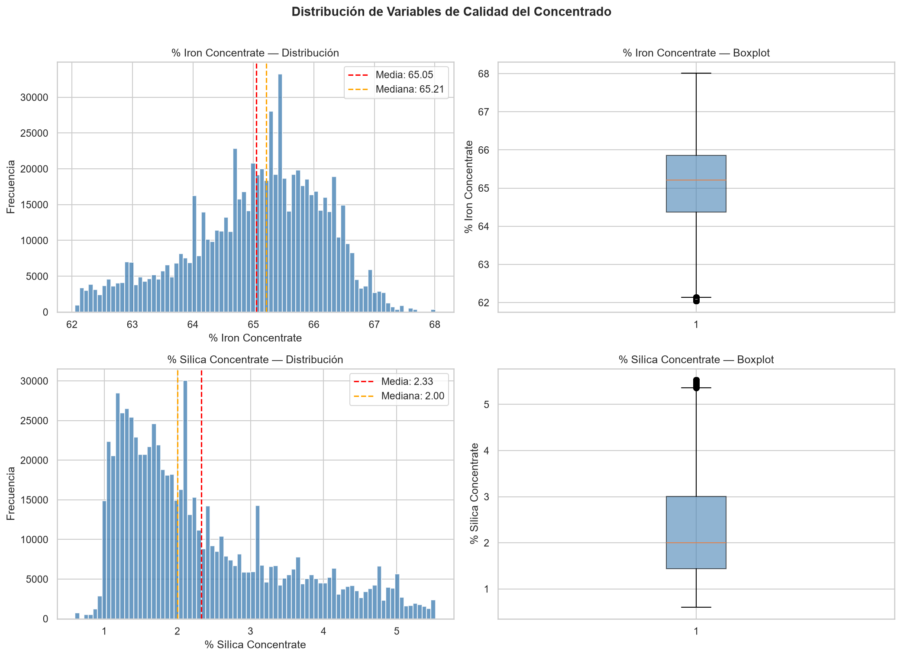
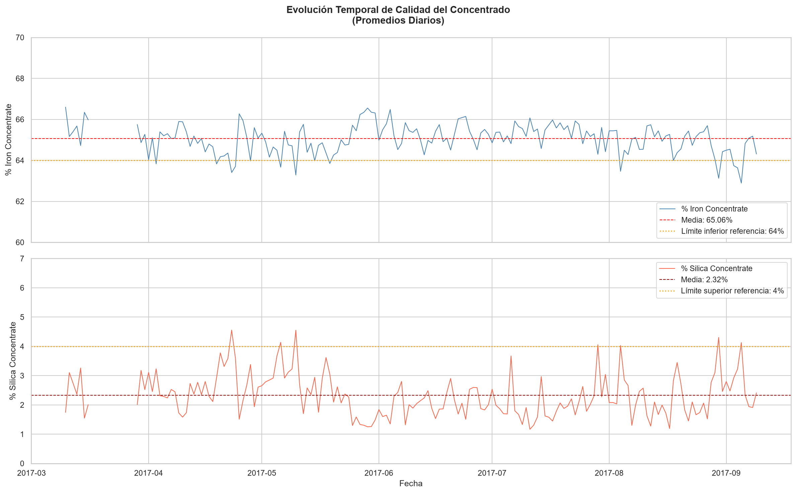
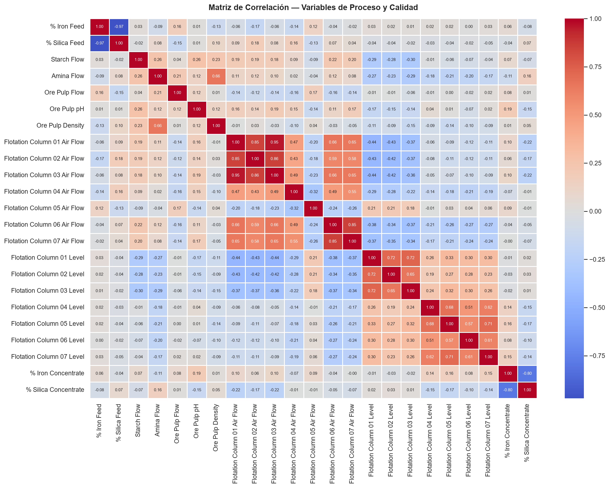
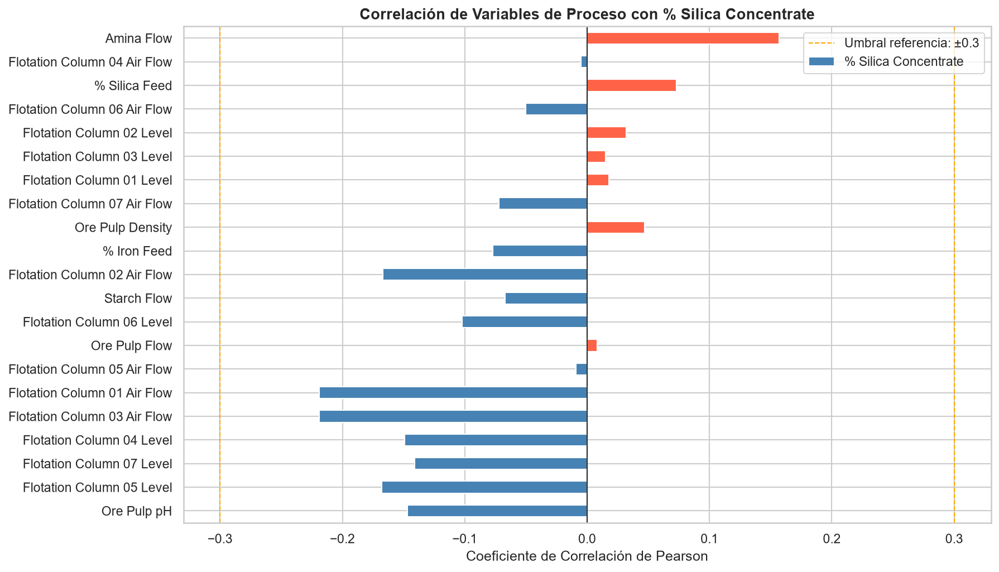

# 🏔️ EDA — Planta de Flotación Minera

**Autor:** Rodolfo Gabriel Riveros Lobos  
**Fecha:** Junio 2026  
**Stack:** Python · Pandas · Matplotlib · Seaborn · Jupyter Notebook

---

## 📋 Descripción del Caso

Análisis exploratorio de datos sobre un proceso industrial de flotación minera.

El objetivo es identificar el comportamiento de las variables de calidad 
del concentrado (% hierro, % sílice) y detectar qué variables operativas 
presentan mayor correlación con la calidad del producto final.

Este análisis simula un escenario real de Data Analyst Junior 
en operaciones mineras.

---

## 📦 Dataset

**Fuente:** Kaggle — Quality Prediction in a Mining Process  
**Link:** https://www.kaggle.com/datasets/edumagalhaes/quality-prediction-in-a-mining-process  
**Registros:** ~737.000 registros horarios  
**Variables:** 24 variables de proceso e instrumentación

> El dataset no está incluido en este repositorio.  
> Descargarlo desde el link y ubicarlo en `data/raw/`.

---

## 🗂️ Estructura del Proyecto

mining_eda_flotation_plant/

├── data/

│   ├── raw/              ← Dataset original (no versionado)

│   └── processed/        ← Datos procesados

├── notebooks/

│   └── EDA_Flotation_Plant_RRiveros.ipynb

├── src/

│   ├── init.py

│   └── plots.py          ← Módulo de visualizaciones

├── reports/

│   └── INFORME_EJECUTIVO.md

├── images/               ← Gráficos exportados

├── requirements.txt

└── environment.yml

---

## ⚙️ Reproducir el Entorno


```bash
conda create -n mining-eda python=3.11 -y
conda activate mining-eda
pip install -r requirements.txt
```

---

## 🔍 Hallazgos Principales

- 🔹 **El hierro es estable y confiable:** CV% de 1.72%, media 65.05%.
  El proceso cumple estándares comerciales en el 91.3% del tiempo operativo.

- 🔹 **La sílice es la variable crítica:** CV% de 48.37% con distribución 
  asimétrica positiva. Se detectaron 6 días con ambas variables fuera de 
  referencia simultáneamente, agrupados en dos bloques: abril–mayo y 
  agosto–septiembre 2017.

- 🔹 **El flujo de aire es la palanca operativa más efectiva:** 
  Las Columnas 01 y 03 muestran la correlación negativa más fuerte 
  con la sílice (-0.219). Mayor aireación → menor impureza en el concentrado.

- 🔹 **El sistema opera de forma reactiva:** La Amina Flow actúa como 
  indicador de inestabilidad (feedback loop): sus picos revelan momentos 
  donde la planta lucha contra exceso de sílice.

- 🔹 **Parada de planta confirmada:** Gap de 12 días consecutivos 
  (17–28 marzo) consistente con mantenimiento mayor programado.

---

## 📊 Visualizaciones






---

## 📁 Informe Ejecutivo

Ver [`reports/INFORME_EJECUTIVO.md`](reports/INFORME_EJECUTIVO.md)

---

## 🛠️ Stack Técnico

| Herramienta | Uso |
|---|---|
| Python 3.11 | Lenguaje principal |
| Pandas | Manipulación de datos |
| Matplotlib / Seaborn | Visualización |
| Jupyter Notebook | Desarrollo y documentación |
| GitHub | Control de versiones y portfolio |

## 📚 Referencias

Wilson, G. et al. (2017). *Good Enough Practices in Scientific Computing.*  
PLOS Computational Biology. https://doi.org/10.1371/journal.pcbi.1005510